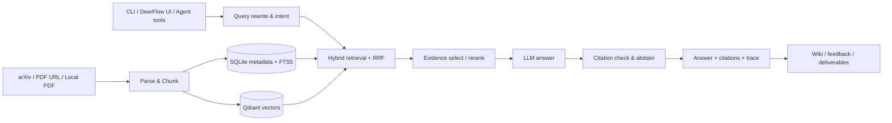

# Agentic Paper RAG｜面向论文研究的可验证 Agentic RAG 工作台

[English](README_EN.md) · [架构文档](docs/ARCHITECTURE.md) · [运行手册](docs/OPERATIONS.md) · [评测指南](docs/RAG_EVAL_GUIDE.md)

[](https://www.python.org/)
[](LICENSE)

Agentic Paper RAG 是一个面向学术论文的可验证本地知识工作台：把 arXiv 论文、PDF URL 或本地 PDF 解析、切分并写入混合索引，再通过受证据约束的 RAG / Agentic RAG 流程完成检索、问答、引用校验、论文发现、知识笔记与交付物生成。

仓库同时提供两种使用层级：可嵌入其他服务的 `paper_rag` Python 包，以及集成 DeerFlow 的浏览器工作台。默认配置优先满足本地复现和工程学习；它不是开箱即用的生产 SaaS。

> **使用声明**：本仓库公开用于项目展示与招聘评估。根项目代码与文档保留全部权利，未授予复制、修改、分发、部署或商业使用许可。`integrations/deer-flow/` 与部分内置技能属于第三方组件，继续适用其各自的许可证与版权声明。

## 为什么值得看

普通的论文问答 Demo 往往只展示“向量检索 + 一次 LLM 调用”。这个项目把一条更完整的研究链路放进同一代码库：

- **从来源到索引**：arXiv、PDF URL、本地 PDF → 解析 → 分块 → embedding → SQLite / Qdrant。
- **从问题到证据**：意图判断、查询改写、HyDE、混合召回、RRF 融合、可选 rerank、证据选择与引用校验。
- **证据不足时拒答**：三档 abstain 决策避免在明显缺少证据时强行生成答案。
- **可观察的 Agentic loop**：保留 rewrite、retrieval rounds、selected evidence、abstain 与 citations 等 trace。
- **从回答到研究资产**：论文发现、Wiki 概念笔记、反馈闭环、订阅 / inbox，以及 Markdown、PPTX、DOCX、LaTeX / BibTeX、PDF 交付物。
- **从库到产品界面**：DeerFlow Gateway、Harness tools 与 Next.js 工作区形成可交互的本地应用。

## 核心能力

| 模块 | 已提供的能力 | 主要位置 |
|---|---|---|
| Ingest | arXiv、远程 PDF、本地 PDF；跨来源去重 | `src/paper_rag/ingest/` |
| Parse & Chunk | MinerU、本地 PyMuPDF fallback；章节、文本及多模态分块 | `src/paper_rag/parse/`、`chunk/` |
| Retrieval | Dense、FTS5 / BM25、RRF 混合融合、可选 BGE reranker | `src/paper_rag/retrieve/` |
| RAG | 简单 QA、Agentic QA、query rewrite、HyDE、reflection、引用校验与拒答 | `src/paper_rag/rag/` |
| Discovery | 从公开论文来源发现候选、评分并记录选择原因 | `src/paper_rag/discovery/` |
| Wiki & Memory | 概念抽取、Wiki 演化、研究记忆与审核队列 | `src/paper_rag/wiki/`、`rag/research_memory.py` |
| Delivery | Survey Markdown、PPTX、DOCX、LaTeX / BibTeX、PDF | `src/paper_rag/deliver/` |
| Feedback & Proactive | 反馈事件、hard cases、订阅、digest、stale reminder、inbox | `src/paper_rag/feedback/`、`proactive/` |
| DeerFlow 集成 | FastAPI Gateway、LangChain tools、subagent、Next.js 工作区 | `integrations/deer-flow/` |
| Evaluation | 召回、引用、claim、ablation、LLM recall 与网关回归 | `tests/eval/`、`docs/RAG_EVAL_GUIDE.md` |

## 系统架构



数据边界很重要：Discovery 返回的标题、摘要和外部 metadata 只用于“找候选”。候选必须完成入库、解析、切块、索引并被 QA 检索命中后，才能成为最终回答的证据。

## 技术栈

- **后端 / 数据**：Python、Pydantic、SQLModel / SQLite、Qdrant、FastAPI。
- **检索 / 模型**：BGE-M3、BGE reranker、FTS5 / BM25、OpenAI-compatible LLM API。
- **论文解析**：MinerU，可回退到 PyMuPDF。
- **Agent 集成**：LangChain / LangGraph、DeerFlow Harness tools。
- **前端**：Next.js、React、TypeScript、pnpm。
- **工程化**：pytest、ruff、pre-commit、Docker、Prometheus / Grafana 示例。

## 运行要求

| 组件 | 建议版本 | 什么时候需要 |
|---|---|---|
| Python | 3.10–3.12；完整 DeerFlow 路径建议 3.12 | 必需 |
| Node.js | 20+ | 启动 DeerFlow 前端时 |
| uv | 稳定版 | 管理 DeerFlow backend 环境时 |
| Docker | 当前稳定版 | 独立 Qdrant、sidecar 或观测栈；本地 embedded Qdrant 不需要 |
| LLM API key | OpenAI-compatible provider | 生成式问答、Wiki 和部分交付物 |

首次使用 dense embedding 时会下载模型，所需时间和磁盘空间取决于模型缓存与网络环境。

## 快速开始：命令行版本

### 1. 克隆并安装

仓库名以连字符开头，因此建议显式指定本地目录名：

```bash
git clone https://github.com/russlzc/--RAGPaper.git RAGPaper
cd RAGPaper

python3 -m venv .venv
source .venv/bin/activate
python -m pip install --upgrade pip
python -m pip install -e ".[dev,ingest,embed]"
```

只做纯逻辑开发或运行轻量测试时，可以先安装：

```bash
python -m pip install -e ".[dev]"
```

### 2. 配置环境变量

```bash
cp .env.example .env
```

编辑本地 `.env`；不要提交真实凭据：

```dotenv
OPENAI_BASE_URL=https://api.deepseek.com
OPENAI_API_KEY=sk-your-key-here
CHAT_MODEL=deepseek-chat
SMALL_MODEL=deepseek-chat
PAPER_RAG_CONFIG=config/local.yaml
```

项目不会自动替你把 `.env` 加密；`.gitignore` 只是最后一道防误提交保护。

### 3. 初始化并入库

`config/local.yaml` 默认使用 embedded Qdrant，因此最小本地流程不要求单独启动 Qdrant 服务。

```bash
python scripts/init_store.py
python scripts/ingest_one.py --arxiv 2310.11511
```

也可以入库本地 PDF：

```bash
python scripts/ingest_one.py --pdf /absolute/path/to/paper.pdf --title "Paper title"
```

### 4. 提问并查看引用

```bash
python scripts/ask.py "What is Self-RAG?"
python scripts/ask.py "What is the main contribution?" --paper-id arxiv:2310.11511
python scripts/ask.py "Show retrieval only" --no-llm --top-k 8
```

回答使用 `[chunk:<id>]` 形式绑定检索证据。没有足够证据时，系统应走 abstain 路径，而不是生成看似合理但无依据的结论。

## 完整 DeerFlow 工作台

### 1. 后端环境

```bash
python3 -m pip install --upgrade uv
uv python install 3.12

cd integrations/deer-flow/backend
uv sync --python 3.12
cd ../../..

export PY="$PWD/integrations/deer-flow/backend/.venv/bin/python"
$PY -m pip install --upgrade pip
$PY -m pip install -e ".[dev,embed,ingest,deliver,deliver-pdf,proactive,deerflow]"
```

### 2. 前端依赖

```bash
cd integrations/deer-flow/frontend
corepack enable
corepack pnpm install
cd ../../..
```

### 3. 启动

终端 A：

```bash
make deerflow-backend
```

终端 B：

```bash
make deerflow-frontend
```

浏览器访问 `http://127.0.0.1:3000/workspace/paper-rag`。工作区包含 QA、Discovery、Knowledge Builder、Wiki、Feedback、Inbox 与 Subscriptions 等页面能力。

## 配置说明

常用配置集中在 `config/local.yaml`：

| 配置段 | 作用 | 本地默认 |
|---|---|---|
| `paths` | 原文、解析结果、索引、SQLite 与模型缓存位置 | `./data/...` |
| `qdrant` | 服务地址或 embedded 存储目录 | embedded local path |
| `embedding` | embedding provider、模型、维度、batch | BGE-M3 |
| `reranker` | 是否启用 rerank 及 top-k | 本地默认关闭 |
| `mineru` | 解析器模式、命令、超时与 fallback | 本地 MinerU + PyMuPDF fallback |
| `rag` | Agentic loop、HyDE、reflection、cache、abstain | 启用 loop 与 abstain |
| `llm` | OpenAI-compatible endpoint、key 与模型名 | 从环境变量读取 |
| `vision` | 图表多模态摘要与本地 fallback | 默认关闭 |
| `wiki` | Wiki 生成、相似阈值与限频 | 启用 |

如果使用远程 Qdrant，请把 `qdrant.local_path` 设为空，并配置 `qdrant.url`。生产环境还需要独立设计认证、网络策略、备份恢复、密钥管理与用户隔离，不能直接照搬本地配置。

## 目录结构

```text
.
├── src/paper_rag/          # 核心 Python 包
├── scripts/                # 初始化、入库、问答、校准与运维脚本
├── config/                 # 默认、本地与生产配置样例
├── integrations/deer-flow/# DeerFlow backend / frontend / skills 集成快照
├── tests/                  # 单元、集成、回归和评测测试
├── docs/                   # 架构、ADR、运行、性能与评测文档
├── examples/               # 最小调用示例
└── course/                 # 学习手册与演示材料
```

## 验证与开发

```bash
make lint             # ruff 静态检查
make test-pytest      # pytest 测试入口
make secret-scan      # 仓库内置的启发式凭据扫描
make smoke            # 轻量 smoke check
```

也可以直接运行核心检查：

```bash
python -m ruff check src scripts tests
python -m pytest -q --ignore=tests/eval
python scripts/secret_scan.py
```

部分测试或真实入库路径依赖可选 extras、模型下载或外部服务。遇到 skip 时应先确认测试的依赖条件，不要把“被跳过”误当作功能已验证。

## 隐私与安全

- 真实 API key、token、cookie、OAuth 数据和 webhook secret 只放在本地环境变量或专用 secret manager。
- `.env`、`data/`、模型缓存、SQLite / Qdrant 数据、日志和导出文件默认不应提交。
- 本地 PDF、解析结果、问题、回答、反馈与 trace 都可能包含论文版权内容或个人研究信息；发布前应单独审查。
- 远程 PDF / 论文 API、LLM provider 和模型下载会产生网络请求，需自行评估数据出境、费用与服务条款。
- DeerFlow 的本地 demo 配置不等于生产安全基线。公开部署前必须开启并验证认证、授权、用户隔离、限流和审计。
- `scripts/secret_scan.py` 是启发式检查，不能替代 GitHub secret scanning、gitleaks / trufflehog 或人工审计。

## 已知边界

- 真实效果依赖论文解析质量、embedding / reranker、语料覆盖与 LLM provider；仓库中的离线报告不保证在其他数据集上复现同等指标。
- MinerU、视觉模型、PPTX / DOCX / PDF 等能力需要额外依赖，最小安装不会包含全部组件。
- embedded Qdrant 适合本地单机体验；并发、备份、高可用和容量规划需改用正式服务部署。
- Wiki、Proactive Agent 与交付物属于增强链路，建议先跑通 ingest → retrieve → QA → citation 主链路。
- 仓库包含较完整的 DeerFlow 集成快照，安装体积与依赖复杂度明显高于纯 Python 包。

## 文档导航

- [系统架构](docs/ARCHITECTURE.md)
- [运行与排障](docs/OPERATIONS.md)
- [实现状态](docs/STATUS.md)
- [RAG 评测指南](docs/RAG_EVAL_GUIDE.md)
- [DeerFlow 集成说明](docs/integration/deerflow_embedded.md)
- [贡献指南](CONTRIBUTING.md)

## 许可证与第三方组件

根项目未授予开源许可证，仅供查看与评估，详见 [LICENSE](LICENSE)。`integrations/deer-flow/` 与部分内置技能携带独立的第三方许可证和版权声明；这些第三方条款不因根项目的使用声明而改变。
