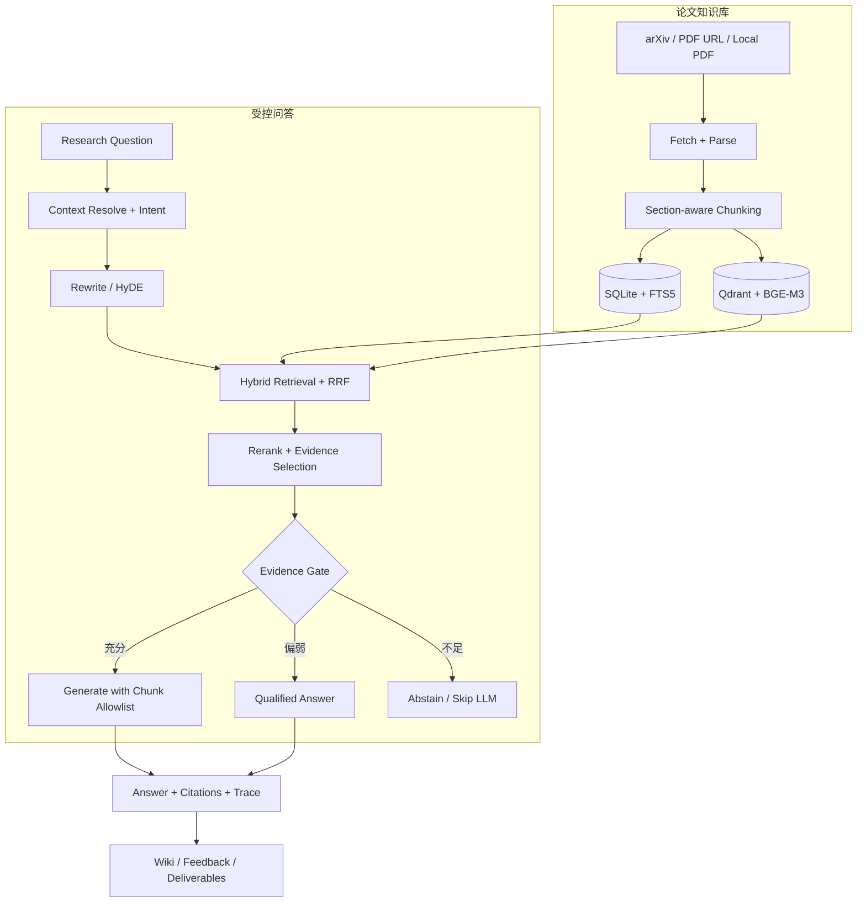

# Agentic Paper RAG

### 面向论文研究的可验证 Agentic RAG 工作台

[English](README_EN.md) · [系统设计](docs/SYSTEM_DESIGN.md) · [评测方法](docs/RAG_EVAL_GUIDE.md) · [运行手册](docs/OPERATIONS.md)

[](https://www.python.org/)
[](#验证项目)
[](LICENSE)

Agentic Paper RAG 把论文发现、结构化入库、跨论文检索和证据型问答串成一条本地研究流水线。系统允许模型帮助理解问题与组织答案，但不允许模型自行决定“什么可以算作证据”：最终结论只能引用本轮真正检索到的论文 Chunk；证据不足时，系统选择拒答。

> 这个项目关注的不是“让回答听起来更像专家”，而是让研究者能够回答三个问题：结论来自哪篇论文、对应哪段原文、证据不足时系统为什么停止回答。

## 30 秒了解项目

| | 设计选择 |
|---|---|
| **输入** | arXiv ID、PDF URL、本地 PDF 或自然语言研究问题 |
| **知识底座** | SQLite 管理论文、Chunk 与运行状态；FTS5 和 Qdrant 分别承担稀疏与稠密检索 |
| **检索策略** | Query Rewrite / HyDE 扩展召回，RRF 融合异构排序，可选 BGE Reranker 精排 |
| **Agent 行为** | 在预算内执行“检索—检查证据—补充检索”，最多 3 轮，不允许无限自循环 |
| **可靠性约束** | Evidence Selection、三档 Abstain、Citation Allowlist 共同决定能否生成和引用什么 |
| **输出** | 带 Chunk 引用与 Trace 的答案，以及可选的 Wiki、Markdown、PPTX、DOCX、BibTeX / LaTeX、PDF |

项目包含可独立调用的 `paper_rag` Python 包，也包含接入 DeerFlow 的浏览器工作台。核心检索问答链可以单独运行；DeerFlow、MinerU、多模态解析和文档生成均为按需启用的扩展路径。

## 一条问题如何变成可核验答案



系统把“发现论文”和“使用论文作证据”明确分开。Semantic Scholar、OpenAlex 或搜索接口返回的标题与摘要只能形成候选；候选必须完成下载、解析、切块、索引，并在当前问答中被检索命中，才有资格进入答案引用集合。

## 五个关键工程决策

### 1. 证据权高于模型记忆

多轮对话历史只用于消解“这篇论文”“第二个方法”等省略表达，不直接成为事实来源。生成阶段收到的是经过 Evidence Selection 的 Chunk 白名单；生成后再次校验引用 ID，阻止模型把外部摘要、旧对话或常识伪装成本轮证据。

### 2. 稀疏与稠密检索各司其职

FTS5 / BM25 擅长精确术语、模型名和公式关键词，BGE-M3 Dense Retrieval 负责语义相近表达。两路结果通过 RRF 按排名融合，避免直接比较不可比的原始分数；可选 Reranker 只对融合后的候选集精排。

### 3. Agentic Loop 必须有边界

系统根据问题意图调整检索深度，通过 Reflection 判断现有证据是否足够。需要补证时可以改写查询并重新检索，但执行轮数、候选数量和时间均受配置约束，默认最多 3 轮。

### 4. “拒答”是一等结果

问答链在生成前区分 `confident`、`weak_evidence` 和 `no_evidence`：

- `confident`：正常生成并绑定引用；
- `weak_evidence`：允许带不确定性限定的回答；
- `no_evidence`：直接跳过 LLM，返回缺少证据的原因。

### 5. 评测拆开看召回、引用和主张

只检查“答案里有没有引用”会高估可靠性。本项目分别评测 Paper / Chunk Retrieval、Citation Precision、Claim Recall、Grounded Claim Recall、无证据拒答，以及 Query Rewrite 带来的 gain / harm。

## 受控离线评测

| 评测切面 | 数据与结果 | 解读 |
|---|---|---|
| Strict Retrieval | 60 条样本；Positive Paper Recall@10 `98.9%`，Positive Chunk Recall@10 `81.1%`，FPR@10 `0` | 论文级定位稳定，细粒度 Chunk 召回仍有改进空间 |
| Claim Grounding | 40 条 Claim Set；Claim Recall `81.1%`，Grounded Claim Recall `72.2%` | “写到答案里”和“被正确证据支撑”是两个不同指标 |
| No-evidence Gate | 10/10 无证据样本正确拒答 | 验证无证据时跳过生成的路径 |
| LLM Rewrite + HyDE | Chunk Recall@10 `71.7% → 93.3%` | 召回提高，但平均延迟 `246 ms → 3468 ms`，Harm Rate `5%` |

详细结果见 [Retrieval Report](docs/RAG_EVAL_REPORT.md)、[Claim Report](docs/RAG_CLAIM_EVAL_REPORT.md) 和 [LLM Recall Report](docs/RAG_LLM_RECALL_REPORT.md)。这些数字来自受控本地数据集，用于回归和方案比较，不代表真实用户采用率或生产环境效果。

## 快速运行核心链路

### 环境

- Python 3.10–3.12
- 首次使用 BGE-M3 时需要下载模型
- 生成式回答需要 OpenAI-compatible API；纯检索和大部分测试不需要

```bash
git clone https://github.com/russlzc/--RAGPaper.git RAGPaper
cd RAGPaper

python3 -m venv .venv
source .venv/bin/activate
python -m pip install --upgrade pip
python -m pip install -e ".[dev,ingest,embed]"
cp .env.example .env
```

在 `.env` 中填写实际使用的模型端点；不要提交真实密钥：

```dotenv
OPENAI_BASE_URL=https://api.example.com/v1
OPENAI_API_KEY=<your-token>
CHAT_MODEL=<chat-model>
SMALL_MODEL=<small-model>
PAPER_RAG_CONFIG=config/local.yaml
```

初始化本地存储并导入论文：

```bash
python scripts/init_store.py
python scripts/ingest_one.py --arxiv 2310.11511

# 或导入本地文件
python scripts/ingest_one.py --pdf /absolute/path/paper.pdf --title "Paper title"
```

执行问答：

```bash
python scripts/ask.py "What problem does Self-RAG solve?"
python scripts/ask.py "Compare the retrieved methods" --top-k 8
python scripts/ask.py "Inspect retrieval only" --no-llm
```

`config/local.yaml` 默认使用 embedded Qdrant，最小体验不要求单独启动 Qdrant 服务。

## 浏览器研究工作台

完整界面位于 `integrations/deer-flow/`，将论文能力封装为 Gateway API、Harness Tools 和 `paper-research` Subagent，并提供 QA、Discovery、Knowledge Builder、Wiki、Feedback、Inbox 与 Subscription 页面。

```bash
# 安装完整 Python 扩展
python -m pip install -e ".[dev,embed,ingest,deliver,deliver-pdf,proactive,deerflow]"

# 安装前端依赖
cd integrations/deer-flow/frontend
corepack pnpm install
cd ../../..

# 分别在两个终端运行
make deerflow-backend
make deerflow-frontend
```

访问 `http://127.0.0.1:3000/workspace/paper-rag`。完整工作台依赖 Python 3.12、Node.js 20+ 和 DeerFlow 自身配置，建议先跑通核心 CLI 链路。

## 代码导航

```text
src/paper_rag/
├── ingest/       论文来源、下载与去重
├── parse/        MinerU 接入与 PyMuPDF fallback
├── chunk/        章节感知和多模态 Chunk
├── store/        入库状态机、SQLite 与 Qdrant
├── retrieve/     Dense / Sparse / RRF / Rerank
├── rag/          Context、Rewrite、Reflection、Abstain、Citation
├── discovery/    候选论文发现与排序
├── wiki/         概念知识与审核队列
├── feedback/     反馈事件与 hard-case 数据
├── proactive/    Subscription、Digest、Inbox、Reminder
└── deliver/      Markdown、PPTX、DOCX、LaTeX / BibTeX、PDF

tests/eval/       检索、引用、Claim 与 Ablation 评测
docs/             架构、ADR、运行手册和评测报告
integrations/     DeerFlow 后端、前端与 Skill 集成
```

## 验证项目

```bash
# 与 GitHub CI 一致的基础静态检查
python -m ruff check --select E,F,W,I --ignore E501 src tests

# 核心单元与回归测试
python -m pytest -q --ignore=tests/eval

# 启发式凭据扫描
python scripts/secret_scan.py
```

当前发布版本在 Python 3.12 下完成 `307 passed`，CI 基础 Ruff 检查通过。真实论文入库、在线模型、MinerU 和 DeerFlow 全栈仍受外部服务、模型与可选依赖影响。

## 安全与数据边界

- `.env`、论文原文、解析结果、向量索引、SQLite、模型缓存、日志和导出文件默认不进入 Git。
- PDF、问题、回答、反馈和 Trace 可能包含论文版权内容或未公开研究信息，应按真实数据治理要求处理。
- 远程论文 API、模型下载与 LLM Provider 会产生网络请求；使用者需要自行评估费用、条款和数据出境风险。
- embedded Qdrant 适合本地单机验证，不等同于生产高可用部署。
- Citation Allowlist 只能约束引用来源，不能保证每个自然语言主张都在语义上完全正确，仍需人工核验。

## 使用声明

根项目代码与文档仅公开用于项目展示和招聘评估，不授予复制、修改、分发、部署或商业使用许可，详见 [LICENSE](LICENSE)。`integrations/deer-flow/` 与内置第三方 Skill 继续适用其各自目录中的许可证和版权声明。
