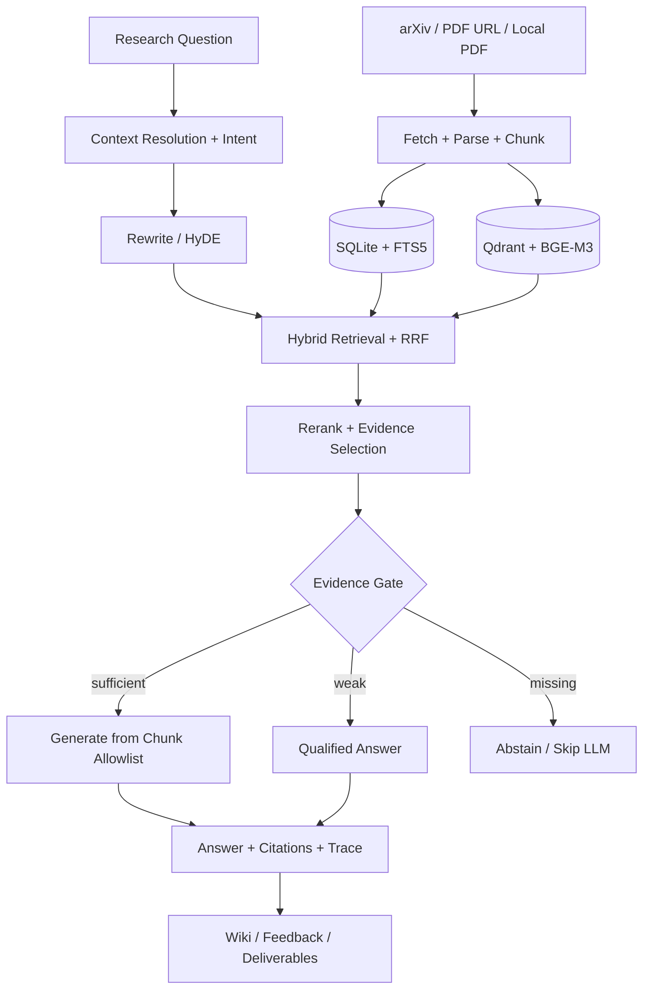

# Agentic Paper RAG

### A verifiable Agentic RAG workspace for academic research

[中文](README.md) · [System Design](docs/SYSTEM_DESIGN.md) · [Evaluation](docs/RAG_EVAL_GUIDE.md) · [Operations](docs/OPERATIONS.md)

[](https://www.python.org/)
[](#verification)
[](LICENSE)

Agentic Paper RAG turns paper discovery, structured ingestion, cross-paper retrieval, and evidence-constrained question answering into one local research pipeline. Models may help interpret a question and compose an answer, but they do not decide what counts as evidence: every final citation must resolve to a chunk retrieved in the current run, and the system abstains when that evidence is insufficient.

> The project is designed to make three questions answerable: Which paper supports this conclusion? Which passage was used? Why did the system stop when evidence was missing?

## Project at a glance

| | Design |
|---|---|
| **Input** | arXiv ID, PDF URL, local PDF, or a natural-language research question |
| **Knowledge layer** | SQLite for metadata, chunks, and run state; FTS5 and Qdrant for sparse and dense retrieval |
| **Retrieval** | Query Rewrite / HyDE, rank-based RRF fusion, and optional BGE reranking |
| **Agent behavior** | A bounded retrieve–inspect–retrieve loop with a default maximum of three rounds |
| **Reliability** | Evidence Selection, three-way Abstention, and a Citation Allowlist |
| **Output** | Answers with chunk citations and traces, plus optional Wiki and document deliverables |

The repository contains an embeddable `paper_rag` Python package and an optional DeerFlow browser workspace. The core retrieval and QA path runs independently; DeerFlow, MinerU, multimodal parsing, and document generation are opt-in layers.

## Evidence flow



Discovery metadata is treated only as a source of candidates. A paper must be downloaded, parsed, chunked, indexed, and retrieved in the current QA run before it can support an answer.

## Core engineering choices

1. **Evidence outranks model memory.** Conversation history resolves references such as “this paper” but never becomes a factual source. Generation receives an explicit chunk allowlist, and citations are validated again after generation.
2. **Sparse and dense retrieval solve different problems.** FTS5 / BM25 preserves exact terms while BGE-M3 handles semantic variants. RRF combines ranks without pretending their raw scores are directly comparable.
3. **The Agentic loop is bounded.** Reflection may trigger another rewritten query, but retrieval rounds, candidate counts, and time are capped.
4. **Abstention is a first-class result.** `confident`, `weak_evidence`, and `no_evidence` determine whether the system generates normally, adds uncertainty, or skips the LLM entirely.
5. **Evaluation separates retrieval from grounding.** Paper recall, chunk recall, citation precision, claim recall, grounded claim recall, no-evidence behavior, and rewrite harm are measured independently.

## Controlled offline evaluation

| Track | Result |
|---|---|
| Strict Retrieval, 60 cases | Positive Paper Recall@10 `98.9%`; Positive Chunk Recall@10 `81.1%`; FPR@10 `0` |
| Claim Set, 40 cases | Claim Recall `81.1%`; Grounded Claim Recall `72.2%` |
| No-evidence gate | `10/10` no-evidence cases abstained correctly |
| LLM Rewrite + HyDE | Chunk Recall@10 `71.7% → 93.3%`; latency `246 ms → 3468 ms`; Harm Rate `5%` |

See the [retrieval](docs/RAG_EVAL_REPORT.md), [claim](docs/RAG_CLAIM_EVAL_REPORT.md), and [rewrite](docs/RAG_LLM_RECALL_REPORT.md) reports. These are controlled local benchmarks for regression and design comparison, not production adoption metrics.

## Run the core pipeline

Requirements: Python 3.10–3.12. An OpenAI-compatible endpoint is needed for generated answers; retrieval and most tests run without one.

```bash
git clone https://github.com/russlzc/--RAGPaper.git RAGPaper
cd RAGPaper

python3 -m venv .venv
source .venv/bin/activate
python -m pip install --upgrade pip
python -m pip install -e ".[dev,ingest,embed]"
cp .env.example .env
```

Configure the provider without committing real credentials:

```dotenv
OPENAI_BASE_URL=https://api.example.com/v1
OPENAI_API_KEY=<your-token>
CHAT_MODEL=<chat-model>
SMALL_MODEL=<small-model>
PAPER_RAG_CONFIG=config/local.yaml
```

Ingest and query:

```bash
python scripts/init_store.py
python scripts/ingest_one.py --arxiv 2310.11511
python scripts/ask.py "What problem does Self-RAG solve?"

# Local PDF and retrieval-only examples
python scripts/ingest_one.py --pdf /absolute/path/paper.pdf --title "Paper title"
python scripts/ask.py "Inspect retrieval only" --no-llm
```

`config/local.yaml` uses embedded Qdrant by default, so a separate vector database is not required for the minimal path.

## Repository guide

```text
src/paper_rag/
├── ingest/       sources, download, and deduplication
├── parse/        MinerU integration and PyMuPDF fallback
├── chunk/        section-aware and multimodal chunks
├── store/        ingestion state machine, SQLite, and Qdrant
├── retrieve/     dense, sparse, RRF, and reranking
├── rag/          context, rewrite, reflection, abstention, citations
├── discovery/    candidate discovery and ranking
├── wiki/         concept knowledge and review queues
├── feedback/     events and hard-case data
├── proactive/    subscriptions, digests, inbox, reminders
└── deliver/      Markdown, PPTX, DOCX, LaTeX / BibTeX, PDF

tests/eval/       retrieval, citation, claim, and ablation evaluation
docs/             architecture, ADRs, operations, and reports
integrations/     DeerFlow backend, frontend, and skills
```

## Optional DeerFlow workspace

The integration under `integrations/deer-flow/` exposes paper capabilities through Gateway APIs, Harness tools, a `paper-research` subagent, and browser pages for QA, Discovery, Knowledge Builder, Wiki, Feedback, Inbox, and Subscriptions.

```bash
python -m pip install -e ".[dev,embed,ingest,deliver,deliver-pdf,proactive,deerflow]"

cd integrations/deer-flow/frontend
corepack pnpm install
cd ../../..

make deerflow-backend   # terminal A
make deerflow-frontend  # terminal B
```

Open `http://127.0.0.1:3000/workspace/paper-rag`. The full workspace requires its own Python 3.12, Node.js 20+, and DeerFlow configuration.

## Verification

```bash
python -m ruff check --select E,F,W,I --ignore E501 src tests
python -m pytest -q --ignore=tests/eval
python scripts/secret_scan.py
```

The current publication was verified on Python 3.12 with `307 passed`; the CI-equivalent Ruff check also passes. Online ingestion, LLMs, MinerU, and the complete DeerFlow stack still depend on external services and optional packages.

## Security and limits

- `.env`, papers, parsed data, vector indexes, databases, model caches, logs, and generated artifacts are excluded from Git.
- Papers, questions, feedback, and traces may contain copyrighted or unpublished research data.
- Remote paper APIs, model downloads, and LLM providers create network traffic and may have cost or data-governance implications.
- Embedded Qdrant is intended for local validation, not high availability.
- A citation allowlist constrains provenance; it does not guarantee that every natural-language claim is semantically correct. Human verification remains necessary.

## Use notice

The root project code and documentation are publicly visible for project presentation and recruitment evaluation only. No permission is granted to copy, modify, distribute, deploy, or commercialize them; see [LICENSE](LICENSE). Components under `integrations/deer-flow/` and bundled third-party skills remain subject to the licenses and copyright notices in their own directories.
