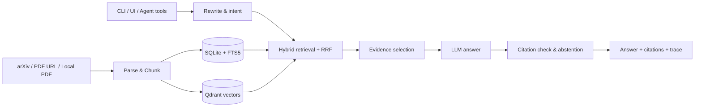

# Agentic Paper RAG | A Verifiable Agentic RAG Workspace for Paper Research

[中文](README.md) · [Architecture](docs/ARCHITECTURE.md) · [Operations](docs/OPERATIONS.md) · [Evaluation Guide](docs/RAG_EVAL_GUIDE.md)

[](https://www.python.org/)
[](LICENSE)

Agentic Paper RAG is a local, evidence-oriented workspace for academic papers. It ingests arXiv papers, PDF URLs, or local PDFs; parses and chunks them; builds SQLite and Qdrant indexes; and answers research questions through a traceable RAG / Agentic RAG pipeline with citation checks and evidence-aware abstention.

The repository includes both an embeddable `paper_rag` Python package and a DeerFlow-based browser workspace. It is primarily intended for local reproduction, engineering study, and experimentation—not as a production-ready SaaS deployment.

> **Use notice:** this public repository is provided for project presentation and recruitment evaluation. All rights to the root project code and documentation are reserved; no permission is granted to copy, modify, distribute, deploy, or commercialize them. Third-party components under `integrations/deer-flow/` and bundled skills remain subject to their own licenses and copyright notices.

## Highlights

- arXiv, remote PDF, and local PDF ingestion with cross-source deduplication.
- MinerU parsing with a local PyMuPDF fallback.
- SQLite metadata and FTS5 / BM25 combined with Qdrant dense retrieval and RRF fusion.
- Optional BGE reranking, query rewriting, HyDE, reflective retrieval, evidence selection, and citation validation.
- Three-way abstention that avoids generating answers when indexed evidence is insufficient.
- Trace output for intent, rewrites, retrieval rounds, selected evidence, abstention, and citations.
- Paper discovery, research memory, evolving wiki notes, feedback, subscriptions, inbox, and digest workflows.
- Markdown, PPTX, DOCX, LaTeX / BibTeX, and PDF deliverables.
- DeerFlow Gateway, Harness tools, subagent integration, and a Next.js workspace.
- Retrieval, citation, claim, ablation, LLM-recall, and gateway regression evaluation assets.

## Architecture



Discovery metadata is not treated as final evidence. A candidate must be ingested, parsed, chunked, indexed, and retrieved by the QA pipeline before it may support an answer.

## Quick Start

The remote repository name begins with hyphens, so use an explicit local directory name:

```bash
git clone https://github.com/russlzc/--RAGPaper.git RAGPaper
cd RAGPaper

python3 -m venv .venv
source .venv/bin/activate
python -m pip install --upgrade pip
python -m pip install -e ".[dev,ingest,embed]"

cp .env.example .env
```

Edit `.env` with your own OpenAI-compatible provider. Never commit real credentials.

```dotenv
OPENAI_BASE_URL=https://api.deepseek.com
OPENAI_API_KEY=sk-your-key-here
CHAT_MODEL=deepseek-chat
SMALL_MODEL=deepseek-chat
PAPER_RAG_CONFIG=config/local.yaml
```

The local configuration uses embedded Qdrant by default:

```bash
python scripts/init_store.py
python scripts/ingest_one.py --arxiv 2310.11511
python scripts/ask.py "What is Self-RAG?"
```

Local PDFs are also supported:

```bash
python scripts/ingest_one.py --pdf /absolute/path/to/paper.pdf --title "Paper title"
```

## Full DeerFlow Workspace

```bash
python3 -m pip install --upgrade uv
uv python install 3.12

cd integrations/deer-flow/backend
uv sync --python 3.12
cd ../../..

export PY="$PWD/integrations/deer-flow/backend/.venv/bin/python"
$PY -m pip install -e ".[dev,embed,ingest,deliver,deliver-pdf,proactive,deerflow]"

cd integrations/deer-flow/frontend
corepack enable
corepack pnpm install
cd ../../..
```

Start the backend and frontend in separate terminals:

```bash
make deerflow-backend
```

```bash
make deerflow-frontend
```

Open `http://127.0.0.1:3000/workspace/paper-rag`.

## Repository Layout

```text
src/paper_rag/           Core Python package
scripts/                 Ingestion, QA, calibration, and operations scripts
config/                  Default, local, and production configuration examples
integrations/deer-flow/  DeerFlow backend, frontend, and skill integration snapshot
tests/                   Unit, integration, regression, and evaluation tests
docs/                    Architecture, ADRs, operations, performance, and evaluation docs
examples/                Small Python examples
course/                  Learning and demonstration material
```

## Validation

```bash
make lint
make test-pytest
make secret-scan
make smoke
```

Some paths require optional dependencies, model downloads, or external services. A skipped test is not evidence that the corresponding capability has been validated.

## Security and Privacy

- Keep API keys, tokens, cookies, OAuth data, and webhook secrets in environment variables or a dedicated secret manager.
- Do not publish `.env`, `data/`, model caches, SQLite / Qdrant data, logs, generated exports, or private PDFs without review.
- Paper text, prompts, answers, feedback, and traces may contain copyrighted or sensitive research material.
- Remote paper APIs, model downloads, and LLM providers create network traffic and may have data-governance or cost implications.
- The local DeerFlow configuration is not a production security baseline. Public deployment requires verified authentication, authorization, user isolation, rate limiting, secret management, and audit logging.
- The bundled secret scan is heuristic and does not replace platform secret scanning or tools such as gitleaks / trufflehog.

## Known Limits

- Output quality depends on parsing, corpus coverage, retrieval models, and the selected LLM provider.
- MinerU, vision, document delivery, and full DeerFlow workflows require additional dependencies.
- Embedded Qdrant is intended for local single-node use, not high availability.
- The complete DeerFlow snapshot is substantially heavier than the standalone Python package.

## License

The root project is not distributed under an open-source license and is provided for viewing and evaluation only; see [LICENSE](LICENSE). DeerFlow integration code and bundled skills retain their independent third-party licenses and copyright notices.
